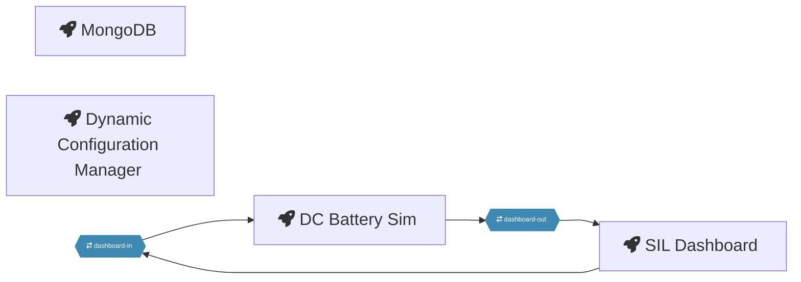

```mermaid
%%{ init: { 'flowchart': { 'curve': 'monotoneX' } } }%%
graph LR;
MongoDB[fa:fa-rocket MongoDB &#8205]
Dynamic_Configuration_Manager[fa:fa-rocket Dynamic Configuration Manager &#8205]
dashboard-in{{ fa:fa-arrow-right-arrow-left dashboard-in &#8205}}:::topic --> DC_Battery_Sim[fa:fa-rocket DC Battery Sim &#8205];
DC_Battery_Sim[fa:fa-rocket DC Battery Sim &#8205] --> dashboard-out{{ fa:fa-arrow-right-arrow-left dashboard-out &#8205}}:::topic;
dashboard-out{{ fa:fa-arrow-right-arrow-left dashboard-out &#8205}}:::topic --> SIL_Dashboard[fa:fa-rocket SIL Dashboard &#8205];
SIL_Dashboard[fa:fa-rocket SIL Dashboard &#8205] --> dashboard-in{{ fa:fa-arrow-right-arrow-left dashboard-in &#8205}}:::topic;


classDef default font-size:110%;
classDef topic font-size:80%;
classDef topic fill:#3E89B3;
classDef topic stroke:#3E89B3;
classDef topic color:white;
```